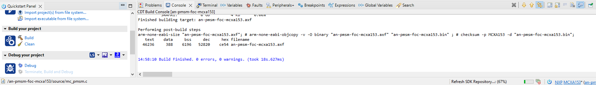
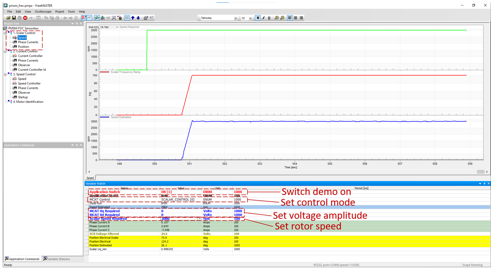
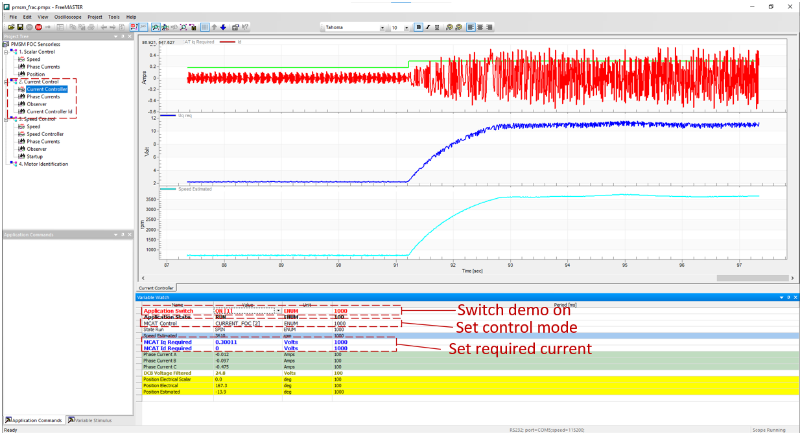
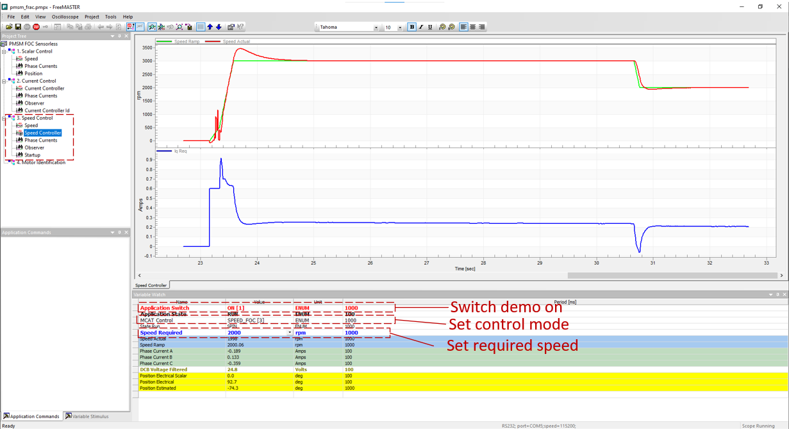

# NXP Application Code Hub

## AN14099: PMSM Sensorless FOC Using MCXA153

This application note describes the implementation of sensorless flux
oriented control(FOC) application for 3-phase Permanent Magnet Synchronous
Motors (PMSM) on the FRDM-MCXA153 board based on the NXP MCXA153 MCU. Please refer to AN14099 <!--[AN14099](https://www.nxp.com/docs/en/application-note/AN14099.pdf)Will add after release --> for complete instructions on how to use this software.  
The MCXA series MCUs expands the MCX Arm® Cortex®-M33 product offerings with multiple high-speed connectivity, operating up to 96 MHz, serial peripherals, timers, analog and low power consumption. The Enhanced Flex Pulse Width Modulator(eFlexPWM) contains three sub-modules, each has a 16-bit counter which can work with 192MHz clock source and supports a pair of complementary output and 3 fault inputs. 
Analog component includes one 16-bit, up to 16channels and max 4Msps SAR ADC and 2 analog comparator.
This application note mainly introduces the principle of PMSM FOC, hardware and software implementation with NXP development kit, including a detailed peripheral setup,driver description and FreeMASTER operation guide.

#### Boards: FRDM-MCXA153
#### Categories: Motor Control
#### Peripherals: ADC, PWM
#### Toolchains: MCUXpresso IDE

## Table of Contents
1. [Software](#step1)
2. [Hardware](#step2)
3. [Setup](#step3)
4. [FreeMASTER operation](#step4)
5. [FAQs](#step5) 
6. [Support](#step6)
7. [Release Notes](#step7)

## 1. Software
- Download and install [MCUXpresso IDE V11.9.0 or later](https://www.nxp.com/design/design-center/software/development-software/mcuxpresso-software-and-tools-/mcuxpresso-integrated-development-environment-ide:MCUXpresso-IDE).
- Download and install the latest version of [FreeMASTER](https://www.nxp.com/design/software/development-software/freemaster-run-time-debugging-tool:FREEMASTER)(3.2.2.2).
- Download the code from Git repository an-pmsm-foc-mcxa153 <!--[an-pmsm-foc-mcxa153](https://github.com/nxp-appcodehub/an-pmsm-foc-mcxa153/browse)-->.  
- MCUXpresso for Visual Studio Code: This example supports MCUXpresso for Visual Studio Code, for more information about how to use Visual Studio Code please refer [here](https://www.nxp.com/design/training/getting-started-with-mcuxpresso-for-visual-studio-code:TIP-GETTING-STARTED-WITH-MCUXPRESSO-FOR-VS-CODE).

## 2. Hardware
- FRDM-MCXA153 Development Board.<!--[FRDM-MCXA153 Development Board](TBD).-->
- [FRDM-MC-LVPMSM](https://www.nxp.com/design/development-boards/freedom-development-boards/mcu-boards/nxp-freedom-development-platform-for-low-voltage-3-phase-pmsm-motor-control:FRDM-MC-LVPMSM).
- [LINIX 45ZWN24 motor](https://www.nxp.com/design/development-boards/freedom-development-boards/mcu-boards/low-voltage-3-phase-motor-for-frdm-platform:FRDM-MC-LVMTR).
- Personal Computer
- USB type-C cable and 24V adaptor.

## 3. Setup
1. Open MCUXpresso IDE, in the Quick Start Panel, choose **Import from Application Code Hub** 

	

2. Enter the demo name in the search bar.

	 

3. Click **Copy GitHub link**, MCUXpresso IDE will automatically retrieve project attributes, then click **Next>**.

	

4. Select **main** branch and then click **Next>**, Select the MCUXpresso project, click **Finish** button to complete import.

	  

4. Click **Build** to start compiling the project.

	 	
    
### 3.2 Step 2
Connect the **FRDM-MC-LVPMSM** shield to the **J1~J4** arduino connector of **FRDM-MCXA153** board. Connect the 3-phase wire of the motor to the J7 connector on FRDM-MC-LVPMSM according to phase sequence(**White** wide--phase**A**; **Bule** wide--phase**B**; **Green** wide--phase**C**). Power the FRDM-MC-LVPMSM board with a 24V adaptor.  
  
Compile the project and use a USB cable to connect to the EVK board via **J15** connector. Use MCU-LINK to download program into MCU.  
### 3.3 Step 3
Compile the project and download program into MCU.  Press SW3 on FRDM board to control the motor to run or stop. Or use FreeMASTER project **"pmsm_frac.pmpx"** in the code package to control the motor, change rotor speed and obverse the speed or other value.  
## 4. FreeMASTER operation
The FreeMASTER can be used to completely control and easily tune the sensorless FOC application. The operation of different control mode of the demo in FreeMASTER are described more closely here.  
### 4.1 Scalar Control
The scalar control diagram is the simplest type of motor control techniques. The ratio between the magnitude of the stator voltage and the frequency must be kept at the nominal ratio. Hence, the control method is sometimes called Volt per Hertz or V/Hz.  The position estimation BEMF observer and tracking observer algorithms run on the background, even if the estimated position information is not directly used.  
Select “Scalar Control” sub block of the FreeMASTER project and choose “SCALAR_CONTROL[0]” mode of MACT Control in Variable Watch window.  
 
### 4.2 Current Control
The current FOC control requires the rotor position feedback and the currents transformed into a d-q reference frame. There are two reference variables Id_req and Iq_req available for the motor control. The d-axis current component id_req is responsible for the rotor flux control. The q-axis current component of the current iq_req generates a torque and by its application, the motor starts running. By changing the polarity of the current iq_req, the motor changes the direction of rotation. Supposing that the BEMF observer is tuned correctly, the current PI controllers can be tuned using the current FOC control structure.  
 
### 4.3 Speed Control
The speed PMSM sensor/sensorless FOC is activated by enabling the speed FOC control structure. Enter the required speed into the “Speed_req” field. The d-axis current reference is held at 0 during the entire FOC operation.  
  
## 5. FAQs
No FAQs have been identified for this project.

## 6. Support
#### Project Metadata
<!----- Boards ----->

<!----- Categories ----->

<!----- Peripherals ----->
 

<!----- Toolchains ----->

Questions regarding the content/correctness of this example can be entered as Issues within this GitHub repository.

>**Warning**: For more general technical questions regarding NXP Microcontrollers and the difference in expected funcionality, enter your questions on the [NXP Community Forum](https://community.nxp.com/)

## 7. Release Notes
| Version | Description / Update                           | Date                        |
|:-------:|------------------------------------------------|----------------------------:|
| 1.0     | Initial release on Application Code Hub        | January 30th 2024 |

